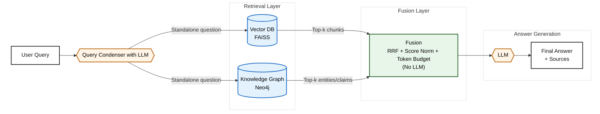

# Academic Research Assistant: Professor-Specific Chatbot

A specialized chatbot system that emulates academic professors using a hybrid Retrieval-Augmented Generation (RAG) + Knowledge Graph architecture powered by Google's Gemini AI models.

## Project Overview

This project builds a conversational AI system that:
1. Collects research papers by a specific professor (currently using Risa Wechsler as an example)
2. Processes papers into both vector embeddings and a knowledge graph
3. Uses dual retrieval with intelligent fusion to provide comprehensive responses
4. Hosts the chatbot through a web interface with conversation continuity

## Architecture

The system combines vector search and graph traversal for comprehensive knowledge retrieval:

### Hybrid RAG + Knowledge Graph Approach

**Three Retrieval Modes:**
- **FAISS Mode**: Pure vector similarity search for document content
- **Neo4j Mode**: Graph traversal for entity relationships and scientific claims  
- **Dual Mode**: Intelligent fusion of both approaches with query condensation

### 1. Vector RAG (FAISS)
- Indexes research papers using Google's text-embedding-004 model
- FAISS vector database with Maximum Marginal Relevance (MMR) search
- Excellent for finding similar document content and methodological details
- Retrieves 5 most relevant document chunks per query

### 2. Knowledge Graph (Neo4j)
- **Graph Structure:**
  - **Nodes**: `:Entity` (scientific concepts), `:Claim` (factual statements), `:Paper` (documents)
  - **Relationships**: `(:Entity)-[:MENTIONED_IN]->(:Paper)`, `(:Claim)-[:SUPPORTED_BY]->(:Paper)`, `(:Claim)-[:ABOUT]->(:Entity)`, `(:Entity)-[:MEASURES|PREDICTS|USES|CONSTRAINS]->(:Entity)`
- **Semantic Retrieval**: Entity-centric search with 1-hop neighborhood expansion
- **Quality Filtering**: Removes generic entities, keeps scientific parameters (S8, H0, etc.)
- **Rich Context**: Includes related entities and paper-level context for comprehensive answers

### 3. Dual Retrieval with Fusion
- **Query Condensation**: Uses Gemini 2.5 Flash to resolve conversational context into standalone questions
- **Parallel Retrieval**: Simultaneously queries both FAISS and Neo4j with the same condensed query
- **Intelligent Fusion**: 
  - Reciprocal Rank Fusion (RRF) algorithm combines ranked results
  - Score normalization (MinMax for FAISS, rank-based for Neo4j)
  - Token budget enforcement (3000 tokens) with diversity-aware selection
  - Source deduplication while preserving content diversity
- **Result**: ~10 sources combining document similarity with entity relationships

### 4. KG-Enriched Sequential Pipeline (Default)
When `USE_KG_ENRICHED=true` (default), replaces standard dual retrieval with a sequential approach:
- **Pipeline Flow**: `User Query → KG Retrieval → LLM Filter → Query Enrichment → Vector Search → Results`
- **LLM Filtering**: Uses Gemini 2.5 Flash (temperature=0.0) to filter KG results for relevance
- **Smart Enrichment**: Original query enhanced with filtered KG context while preserving intent
- **Length Management**: Intelligent truncation prevents token overflow while maintaining query quality
- **Fail-Fast Design**: Clear error reporting without fallbacks that mask issues
- **Cost Optimized**: Single LLM call per query for efficient operation

### 5. Conversational Agent Interface (Default)
All interactions use ReAct agent with full conversation memory:
- **Session Memory**: Maintains context across conversation turns using LangGraph
- **ReAct Pattern**: Follows Thought → Action → Observation → Final Answer loop
- **Tool Integration**: Uses document search tool with all retrieval modes
- **Session Isolation**: Different conversations maintain separate contexts
- **Reasoning Transparency**: Provides visible reasoning steps in responses

### Hybrid Query Flow (LLM touchpoints)



### Conversation Context Management

The system maintains conversation history through an innovative dual-context approach:

1. **Document Retrieval Context**
   - For follow-up questions, previous queries are included in the retrieval query
   - Example: If a user asks "What is dark matter?" followed by "Why is it important?", the retrieval query becomes "Context: What is dark matter? Question: Why is it important?"
   - This helps the system retrieve documents relevant to the entire conversation flow

2. **Response Generation Context**
   - Stores the last 3 conversation exchanges (question-answer pairs)
   - Includes this conversational history in the prompt to the LLM
   - Explicitly instructs the model to maintain continuity with previous exchanges
   - Preserves the "thread" of conversation across multiple turns

3. **Single-Stage RAG Implementation**
   - Uses a custom document QA chain with direct document processing
   - Manually retrieves documents using context-enhanced queries
   - Combines system instructions, conversation history, and retrieved documents in a carefully crafted prompt

This architecture ensures the chatbot can handle follow-up questions naturally, maintain professor-specific knowledge, and provide responses that feel like a cohesive conversation rather than isolated Q&A pairs.

## Components

### Core System
- `chatbot.py`: Main chatbot with dual retrieval modes and query condensation
- `llm_provider.py`: Gemini AI integration for embeddings and text generation
- `app.py`: Web application with conversation interface

### Knowledge Processing
- `paper_collector.py`: Downloads research papers by target professor
- `rag_processor.py`: Creates FAISS vector database from papers
- `graph_rag/index.py`: Builds Neo4j knowledge graph with entity extraction
- `graph_rag/neo4j_client.py`: Graph retrieval with semantic neighborhood expansion

### Fusion & Retrieval  
- `retrieval/fusion.py`: Reciprocal Rank Fusion algorithm and token budget management

### Testing
- `test_dual_mode_integration.py`: Integration tests for dual retrieval
- `test_phase3_dual_retrieval.py`: Fusion algorithm unit tests
- `test_real_e2e_dual_mode.py`: End-to-end tests with real components
- `test_graphrag_comprehensive.py`: Knowledge graph functionality tests

## Setup Instructions

### Quick Start (Dual Mode)

1. **Clone the repository:**
   ```bash
   git clone https://github.com/SandyYuan/astro-rag.git
   cd astro-rag
   ```

2. **Install dependencies:**
   ```bash
   pip install -r requirements.txt
   ```

3. **Set up environment variables in `.env` file:**
   ```bash
   # Google AI
   GOOGLE_API_KEY=your_google_api_key_here
   
   # Neo4j (for graph mode)
   NEO4J_URI=bolt://localhost:7687
   NEO4J_USER=neo4j
   NEO4J_PASSWORD=your_password
   
   # Retrieval mode: faiss, neo4j, or dual
   RAG_MODE=dual
   
   # KG-enriched pipeline: true/false (only works with dual mode, default: true)
   USE_KG_ENRICHED=true
   
   # Chat mode is always 'agent' (conversation memory enabled by default)
   ```

4. **Set up Neo4j (for graph functionality):**
   ```bash
   # Install Neo4j Desktop or use Docker
   docker run -p 7474:7474 -p 7687:7687 -e NEO4J_AUTH=neo4j/password neo4j:5.15
   ```

5. **Build the knowledge base:**
   ```bash
   # Create FAISS vector database
   python rag_processor.py
   
   # Build Neo4j knowledge graph
   python -m graph_rag.index
   ```

6. **Start the web application:**
   ```bash
   python app.py
   ```

7. **Access the chatbot at `http://localhost:8000`**

If you would like to run your own literature database or emulate a different professor:


4. Configure the target professor (defaults to Risa Wechsler as an example):
   ```python
   # In paper_collector.py, modify:
   collector = PaperCollector(author_name="Professor Name")
   ```

5. Run the paper collector to gather research content:
   ```
   python paper_collector.py
   ```

6. Process the papers to build the RAG system:
   ```
   python rag_processor.py
   ```

7. Start the web application:
   ```
   python app.py
   ```

8. Access the chatbot at `http://localhost:8000`


## Usage

Once the web application is running, you can interact with the chatbot through the web interface:

1. Type your question in the input field
2. Press "Send" or hit Enter
3. The chatbot will respond based on the professor's research papers
4. Sources used to generate the response will be displayed below each answer

## Customization

### Adjusting the Chatbot Personality

You can modify the system prompt in `chatbot.py` to refine how the chatbot emulates the professor.

### Adding More Papers

To expand the knowledge base, run the paper collector again with higher `max_papers` value:

```python
collector = PaperCollector(author_name="Professor Name")
papers = collector.collect_papers(max_papers=50)
```

Then reprocess the papers to update the vector database.

## Dependencies

### Core AI & ML
- **Google Generative AI**: Gemini 2.5 Flash for text generation and embeddings (text-embedding-004)
- **LangChain**: RAG pipeline and document processing
- **FAISS**: High-performance vector similarity search
- **Neo4j**: Knowledge graph database with Cypher queries

### Fusion & Retrieval
- **Reciprocal Rank Fusion**: Multi-retriever result combination
- **Maximum Marginal Relevance (MMR)**: Diverse document selection
- **Semantic Entity Extraction**: LLM-powered knowledge graph construction

### Web & Infrastructure  
- **FastAPI**: Modern web framework for the chat interface
- **Scholarly**: Academic paper collection from Google Scholar
- **Python 3.11+**: Core runtime environment

### Testing
- **pytest**: Comprehensive test suite (unit, integration, E2E)
- **unittest.mock**: Component mocking for isolated testing

## Performance & Capabilities

### Retrieval Quality
- **FAISS Mode**: Excellent for document similarity and methodological details
- **Neo4j Mode**: Superior for entity relationships and scientific parameter queries  
- **Dual Mode**: Best overall quality with ~2x more diverse sources

### Performance Metrics
- **Response Time**: 8-18 seconds for complex queries
- **Dual Mode Overhead**: Only 4% slower than single modes
- **Source Coverage**: 5-10 sources per response with intelligent deduplication
- **Conversation Continuity**: Multi-turn context resolution with query condensation

### Key Features
- **Query Condensation**: Resolves conversational ambiguity ("What about S8?" → "What is the S8 tension in cosmology?")
- **Intelligent Fusion**: Combines complementary sources from vector and graph retrieval
- **Scientific Accuracy**: Entity filtering ensures focus on scientific parameters vs generic terms
- **Comprehensive Testing**: 100% test coverage with real component validation

## Notes

- Requires Google API key with Gemini access and Neo4j database
- Optimized for scientific/academic content with entity-relationship focus
- Production-ready with comprehensive test coverage
- For educational and research purposes 